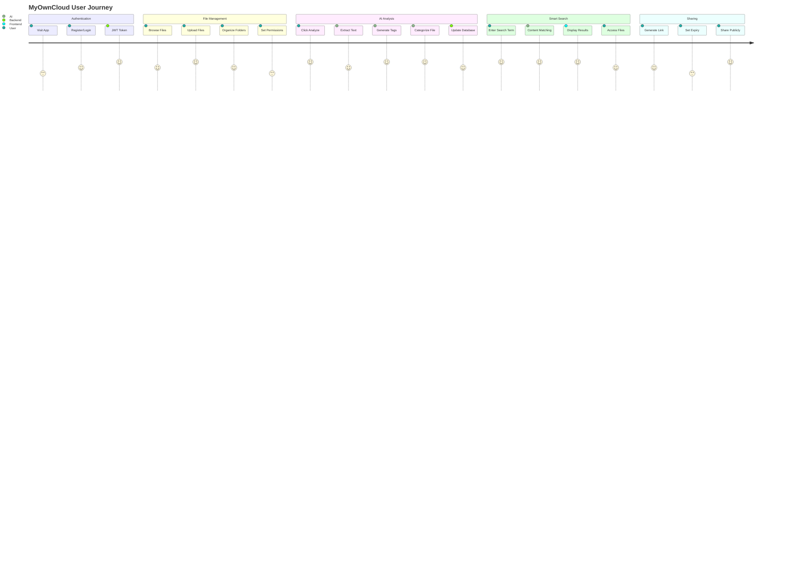
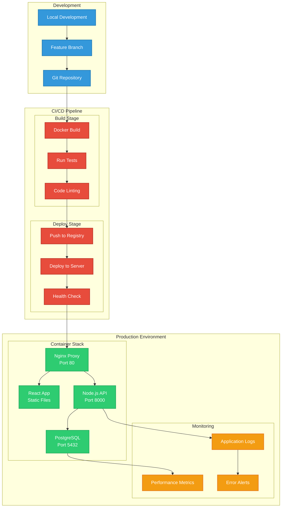
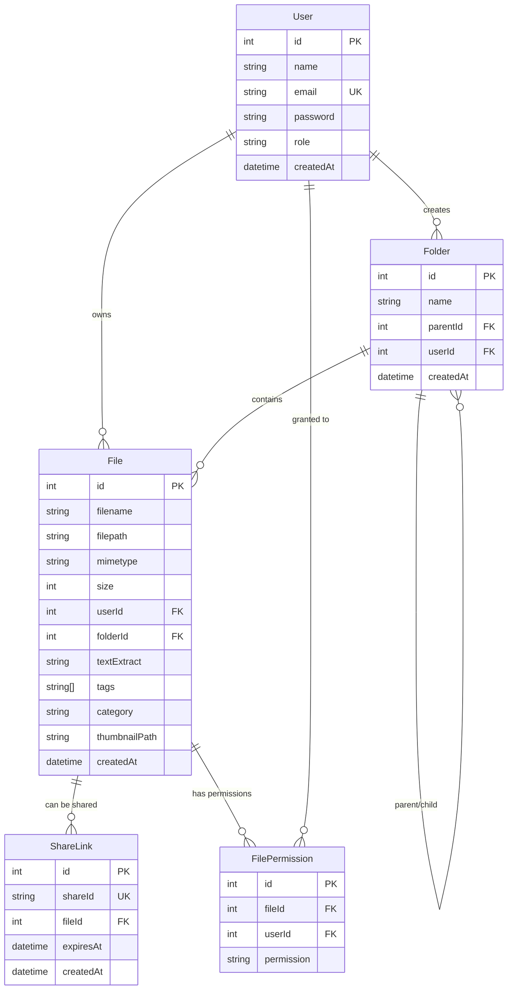
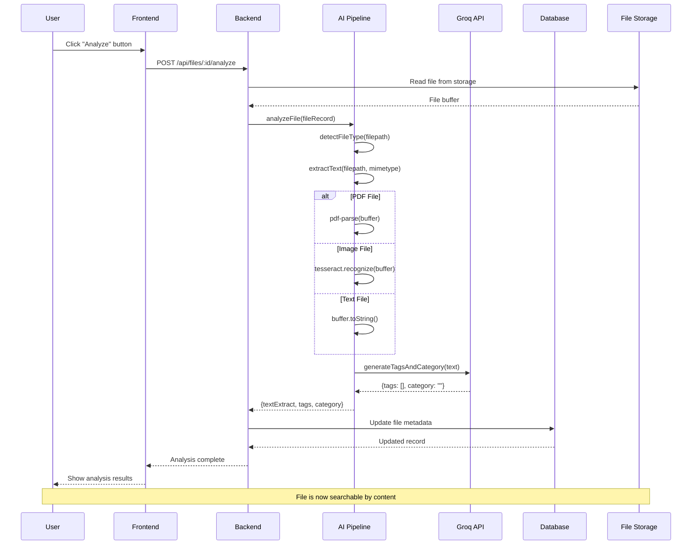

# MyOwnCloud - Complete Project Workflow

## System Architecture & Data Flow

```mermaid
graph TB
    %% User Layer
    subgraph "👤 User Layer"
        U[User Browser]
        M[Mobile Device]
    end

    %% Frontend Layer
    subgraph "🌐 Frontend Layer (Port 3000/80)"
        subgraph "React Components"
            D[Dashboard.jsx<br/>Main Orchestrator]
            S[Sidebar.jsx<br/>AI Search & Nav]
            FG[FileGrid.jsx<br/>File Display]
            FU[FileUploadZone.jsx<br/>Drag & Drop]
            BH[BreadcrumbHeader.jsx<br/>Navigation]
            SB[SearchBar.jsx<br/>Content Search]
        end
        
        subgraph "Frontend Services"
            AX[Axios API Client]
            RT[React Router]
            TW[Tailwind CSS]
        end
    end

    %% Backend Layer
    subgraph "🚀 Backend Layer (Port 8000)"
        subgraph "Express.js Server"
            API[Express App]
            AM[Auth Middleware<br/>JWT Validation]
            
            subgraph "Route Controllers"
                AC[Auth Controller<br/>Login/Register]
                FC[File Controller<br/>CRUD Operations]
                FOC[Folder Controller<br/>Organization]
                PC[Permission Controller<br/>Access Control]
            end
            
            subgraph "API Routes"
                AR[/api/auth/*]
                FR[/api/files/*]
                FoR[/api/folders/*]
                PR[/api/permissions/*]
            end
        end
        
        subgraph "Middleware Stack"
            ML[Multer<br/>File Upload]
            CP[CORS Policy]
            JP[JSON Parser]
            ER[Error Handler]
        end
    end

    %% AI Processing Layer
    subgraph "🤖 AI Processing Layer"
        subgraph "AI Pipeline"
            AP[analyzeFiles.js<br/>Main Pipeline]
            
            subgraph "Text Extraction"
                PDF[PDF Parser<br/>pdf-parse]
                OCR[OCR Engine<br/>Tesseract.js]
                TXT[Text Files<br/>Direct Read]
            end
            
            subgraph "AI Models"
                GROQ[Groq AI Service<br/>Llama 3 Models]
                CAT[Smart Categorization<br/>Resume/Invoice/Report]
                TAG[Tag Generation<br/>Content Keywords]
            end
        end
        
        subgraph "Model Fallback Chain"
            M1[llama3-70b-8192<br/>Primary Model]
            M2[llama-3.1-8b-instant<br/>Fast Fallback]
            M3[mixtral-8x7b-32768<br/>Alternative]
        end
    end

    %% Data Layer
    subgraph "💾 Data Layer"
        subgraph "PostgreSQL Database"
            subgraph "Database Tables"
                UT[Users Table<br/>Auth & Profiles]
                FT[Files Table<br/>Metadata & AI Results]
                FOT[Folders Table<br/>Organization]
                ST[ShareLinks Table<br/>Public Access]
                PT[Permissions Table<br/>Access Control]
            end
            
            PO[Prisma ORM<br/>Type-safe DB Access]
        end
        
        subgraph "File Storage"
            FS[Local Filesystem<br/>./uploads/]
            TH[Thumbnails<br/>./uploads/thumbnails/]
        end
    end

    %% External Services
    subgraph "🌍 External Services"
        GA[Groq API<br/>AI Processing]
        EMAIL[Email Service<br/>Notifications]
    end

    %% User Interactions
    U --> D
    M --> D
    
    %% Frontend Component Flow
    D --> S
    D --> FG
    D --> FU
    D --> BH
    S --> SB
    
    %% Frontend to Backend API Calls
    AX --> API
    SB --> FR
    FU --> FR
    FG --> FR
    
    %% Backend Route Processing
    API --> AM
    AM --> AC
    AM --> FC
    AM --> FOC
    AM --> PC
    
    AC --> AR
    FC --> FR
    FOC --> FoR
    PC --> PR
    
    %% Middleware Processing
    API --> ML
    API --> CP
    API --> JP
    API --> ER
    
    %% File Upload Flow
    ML --> FS
    FC --> AP
    
    %% AI Processing Flow
    AP --> PDF
    AP --> OCR
    AP --> TXT
    PDF --> GROQ
    OCR --> GROQ
    TXT --> GROQ
    
    %% AI Model Hierarchy
    GROQ --> M1
    M1 --> M2
    M2 --> M3
    
    %% AI Results
    GROQ --> CAT
    GROQ --> TAG
    CAT --> FC
    TAG --> FC
    
    %% Database Operations
    FC --> PO
    FOC --> PO
    PC --> PO
    PO --> UT
    PO --> FT
    PO --> FOT
    PO --> ST
    PO --> PT
    
    %% External API Calls
    AP --> GA
    
    %% Data Storage
    FC --> FS
    FC --> TH

    %% Styling
    classDef userClass fill:#3498db,stroke:#2980b9,stroke-width:2px,color:#fff
    classDef frontendClass fill:#e74c3c,stroke:#c0392b,stroke-width:2px,color:#fff
    classDef backendClass fill:#2ecc71,stroke:#27ae60,stroke-width:2px,color:#fff
    classDef aiClass fill:#f39c12,stroke:#e67e22,stroke-width:2px,color:#fff
    classDef dataClass fill:#9b59b6,stroke:#8e44ad,stroke-width:2px,color:#fff
    classDef externalClass fill:#34495e,stroke:#2c3e50,stroke-width:2px,color:#fff

    class U,M userClass
    class D,S,FG,FU,BH,SB,AX,RT,TW frontendClass
    class API,AM,AC,FC,FOC,PC,AR,FR,FoR,PR,ML,CP,JP,ER backendClass
    class AP,PDF,OCR,TXT,GROQ,CAT,TAG,M1,M2,M3 aiClass
    class UT,FT,FOT,ST,PT,PO,FS,TH dataClass
    class GA,EMAIL externalClass
```

## User Journey & Feature Flow



## Deployment Workflow



## Database Schema Flow



## AI Processing Flow


